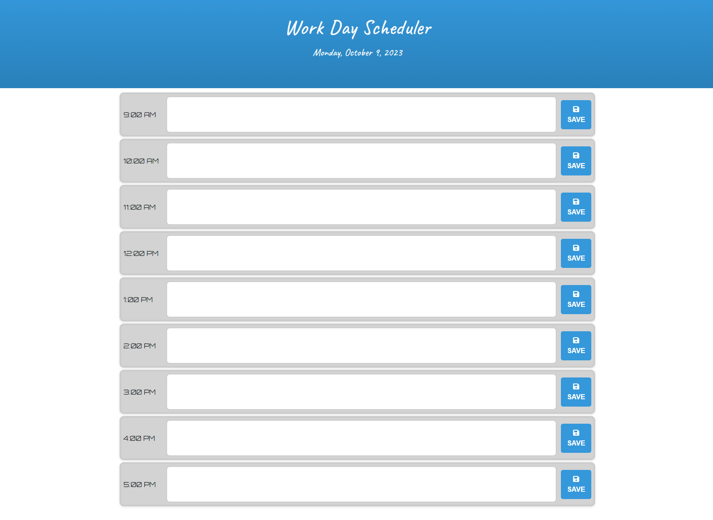

# Work Day Scheduler

* This Application will allow the user to orgranize everything that they have to do from the hours of 9AM to 5PM daily. Each column is color coded for past (lightgray), present (lightgreen) and future (lightcoral) so that it ensures the user knows how to prepare for each time event, what event has pasted, and what even is coming up. 

# Screen shot of application

# Link to deployed application

https://freeway9527.github.io/XengXiong_Challenge5_DaySchedular/

